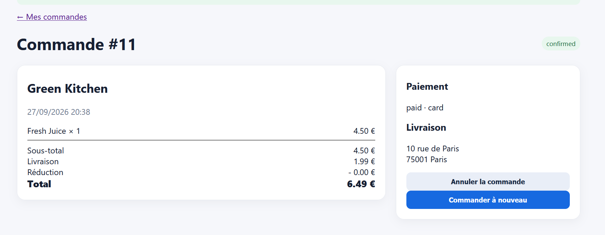

Validation d'une commande sous le seuil minimum

Titre : Possibilité de valider une commande dont le sous-total est inférieur au minimum requis par le restaurant

Contexte : Module de validation du panier / checkout web.

Préconditions : Le restaurant Green Kitchen impose un minimum de commande de $12,00\text{ €}$.   

Étapes de reproduction :
Se rendre sur la fiche de Green Kitchen.   
Ajouter un seul Fresh Juice ($4,50\text{ €}$).   
Aller dans le panier et cliquer sur Passer commande.   Sélectionner une adresse et valider.   

Résultat attendu : La commande doit être bloquée avec le message « Le montant minimum de commande de 12,00 € n'est pas atteint ».

Résultat obtenu : La commande #11 est confirmée pour un sous-total de $4,50\text{ €}$.   

Preuve : Capture de la fiche restaurant ($12,00\text{ €}$ min) + Capture de la commande #11 confirmée.   

Sévérité : Élevée (High)

Priorité : P1