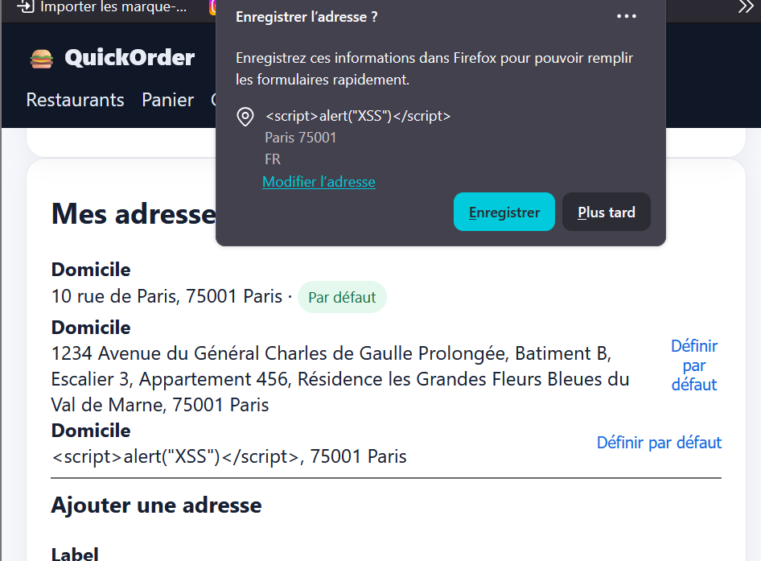

Paramètre limit ignoré sur l'endpoint API /api/restaurants

    Titre : Le paramètre de pagination/limite limit dans l'API REST ne filtre pas le nombre de résultats retournés

    Contexte : Endpoint REST GET /api/restaurants.

    Préconditions : Clé d'API valide (quickorder-demo-key).

    Étapes de reproduction :

        Envoyer une requête GET /api/restaurants?limit=2 via Swagger ou curl.

        Analyser la réponse JSON.

    Résultat attendu : L'API doit retourner une liste contenant au maximum 2 restaurants.

    Résultat obtenu : L'API renvoie la totalité des restaurants en base (plus de 2).

    Preuve : Réponse HTTP 200 contenant la liste complète malgré ?limit=2.

    

    Sévérité : Moyenne (Medium)

    Priorité : P2