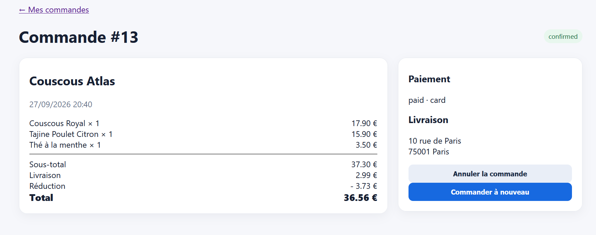

Incohérence dans le calcul du montant de la réduction par coupon

Titre : Écart d'arrondi ou de pourcentage appliqué lors de la validation d'un coupon promotionnel

Contexte : Moteur de calcul du panier et de la facture.

Préconditions : Panier contenant un sous-total de $37,30\text{ €}$.

Étapes de reproduction :

Composer un panier d'un sous-total de $37,30\text{ €}$ chez Couscous Atlas.
Appliquer un coupon de réduction de 10 %.
Valider la commande.

Résultat attendu : Réduction de $3,73\text{ €}$ ($37,30 \times 0,10$) déduite du sous-total, donnant un total de $33,57\text{ €} + 2,99\text{ €} \text{ (livraison)} = 36,56\text{ €}$.

Résultat obtenu : Affichage d'incohérences sur la ventilation de la réduction et le calcul du total final.

Preuve : Capture d'écran du récapitulatif de la commande #13.

Sévérité : Élevée (High)

Priorité : P1