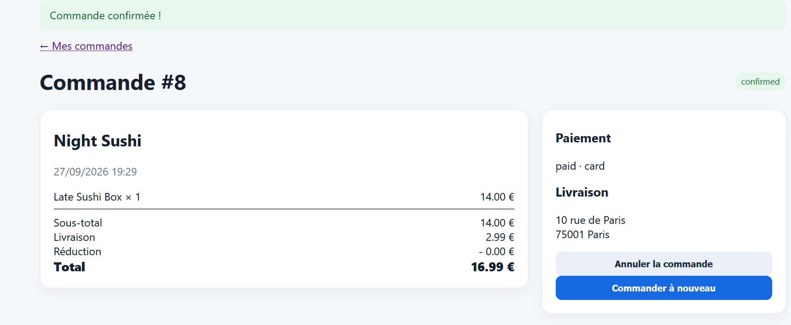

Commande autorisée auprès d'un restaurant fermé

    Titre : Absences de vérification du statut d'ouverture du restaurant lors de la prise de commande

    Contexte : Tunnel d'achat web.

    Préconditions : Le restaurant Night Sushi est affiché avec le statut FERMÉ.

    Étapes de reproduction :

        Consulter la fiche du restaurant Night Sushi.

        Ajouter un produit au panier.

        Valider le paiement et confirmer la commande.

    Résultat attendu : Blocage de l'ajout au panier ou de la validation avec le message « Ce restaurant est actuellement fermé ».

    Résultat obtenu : La commande est validée et passe au statut confirmed.

    Preuve : Capture de la commande confirmée pour le restaurant fermé.

    Sévérité : Critique (Critical)

    Priorité : P0