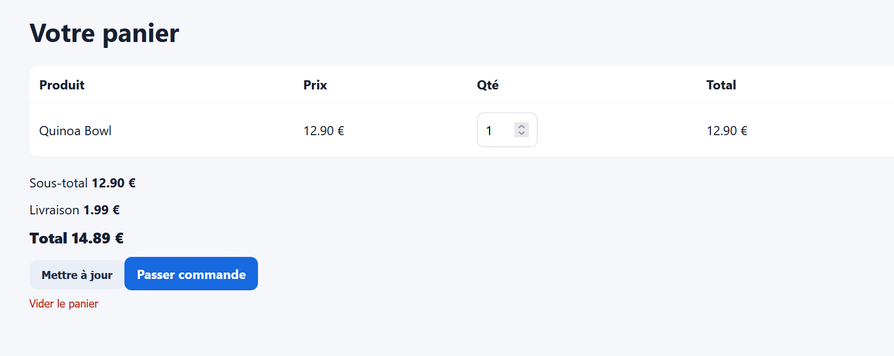
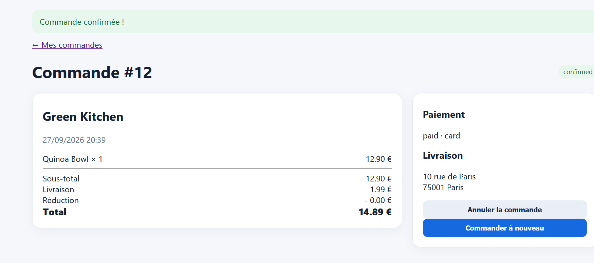

Ajout au panier et commande d'un article hors stock

Titre : Les articles marqués « Stock 0 / HORS STOCK » peuvent être ajoutés au panier et achetés

Contexte : Fiche restaurant et gestion du stock panier.

Préconditions : Le produit Quinoa Bowl chez Green Kitchen indique Stock 0 et un badge HORS STOCK.   

Étapes de reproduction :

Aller sur Green Kitchen.   
Sélectionner la quantité 1 sur le Quinoa Bowl (Stock 0) et cliquer sur Ajouter.   
Ouvrir le panier et cliquer sur Passer commande.   

Résultat attendu : Le bouton d'ajout doit être désactivé ou l'action doit afficher une erreur « Produit indisponible ».

Résultat obtenu : Le produit est ajouté au panier et la commande #12 est confirmée.   

Preuve : Capture de la fiche produit avec Stock 0 + Capture de la commande #12 confirmée.   

Sévérité : Élevée (High)

Priorité : P1