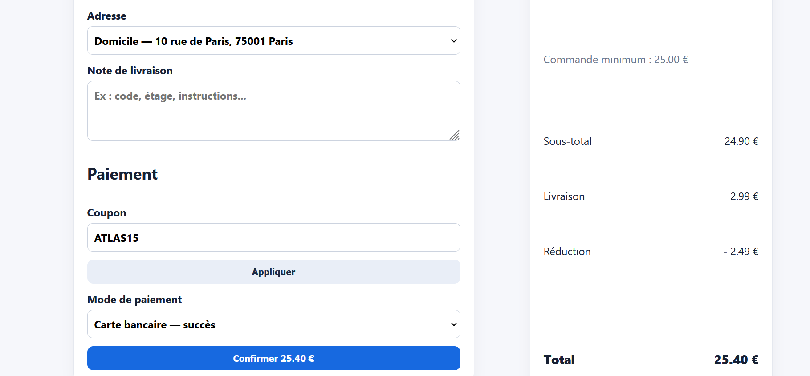

Vulnérabilité d'injection XSS non neutralisée dans le menu des adresses

Titre : Faille XSS Stored / Reflected dans le champ d'affichage des adresses de livraison

Contexte : Composant <select> du choix d'adresse lors du checkout.   

Préconditions : Présence d'un profil ou jeu de données injecté avec du code HTML/JS ().   

Étapes de reproduction :

Atteindre l'étape de sélection de l'adresse de livraison.   
Ouvrir le menu déroulant des adresses enregistrées.   

Résultat attendu : Les caractères spéciaux doivent être échappés (HTML entity encoding) pour afficher le texte brut.

Résultat obtenu : La chaîne d'injection  est rendue telle quelle dans les options du DOM.   

Preuve : Capture d'écran du menu déroulant affichant le script d'injection.   

Sévérité : Critique (Critical)

Priorité : P0