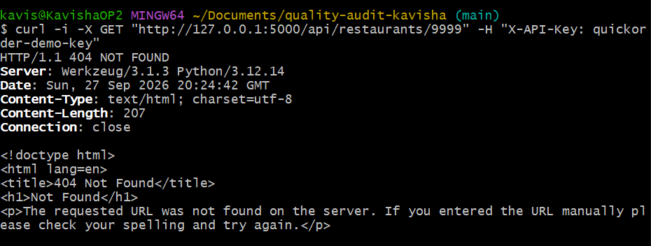

Réponse au format HTML sur une erreur 404 de l'API REST

    Titre : L'API REST renvoie une page HTML générique au lieu d'une réponse JSON lors d'une ressource introuvable

    Contexte : API REST ([http://127.0.0.1:5000/api/](http://127.0.0.1:5000/api/)).

    Préconditions : Clé d'API valide.

    Étapes de reproduction :

        Exécuter : curl -i -X GET "[http://127.0.0.1:5000/api/restaurants/9999](http://127.0.0.1:5000/api/restaurants/9999)" -H "X-API-Key: quickorder-demo-key".

    Résultat attendu : Un retour HTTP 404 Not Found avec un body JSON {"error": "Restaurant not found"} et un header Content-Type: application/json.

    Résultat obtenu : Retour HTTP 404 avec un header Content-Type: text/html et une page HTML <!doctype html>.

    Preuve : Log de la commande curl dans le terminal.

    

    Sévérité : Faible (Low)

    Priorité : P3